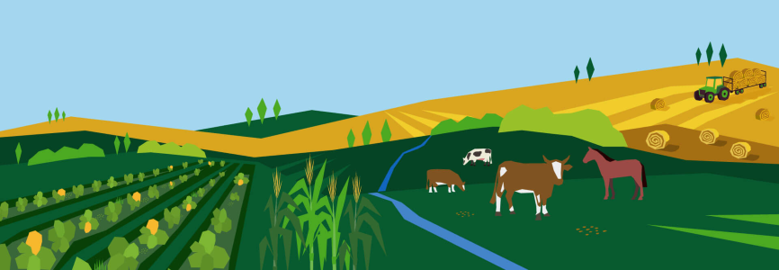

# ALC

ALC gathers and downloads all achived Agricultural Land Commission PDF's for storage.



## Prerequisites

Variables declared in a defaults/main.yaml file:

- SHORT: https://
- URL: ALC root domain
- VAULT: Location to store downloaded files
- TEMP: Location of files created for temporary use

```yaml
- name: Discover what needs to be downloaded
  tags: discover
  block:
    - name: Refresh the sot file
      ansible.builtin.script:
        cmd: xbc.py
    - name: Coallate with current sot file
      ansible.builtin.script:
        cmd: compile.rb
    - name: Document missing and located files
      ansible.builtin.script:
        cmd: exists.rb {{ VAULT }} {{ URL }}
    - name: Filter out missing files that exist elsewhere
      ansible.builtin.script:
        cmd: proof.rb
```

## Run

Navigate to the folder containing your scripts and run:

```bash
./download.rb
```

This will call the ansible playbook:

```console
PLAY [Download ALC Assets] *****************************************************

TASK [Run exists.rb] ***********************************************************
changed: [127.0.0.1]

PLAY RECAP *********************************************************************
127.0.0.1 : ok=1   changed=1   unreachable=0   failed=0   skipped=0   rescued=0   ignored=0
```

## License

Code is distributed under [The Unlicense](https://github.com/nausicaan/free/blob/main/LICENSE.md) and is part of the Public Domain.